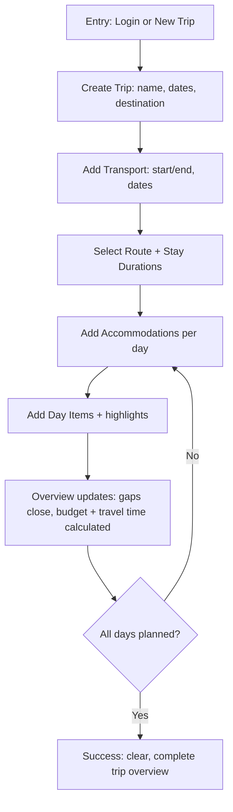
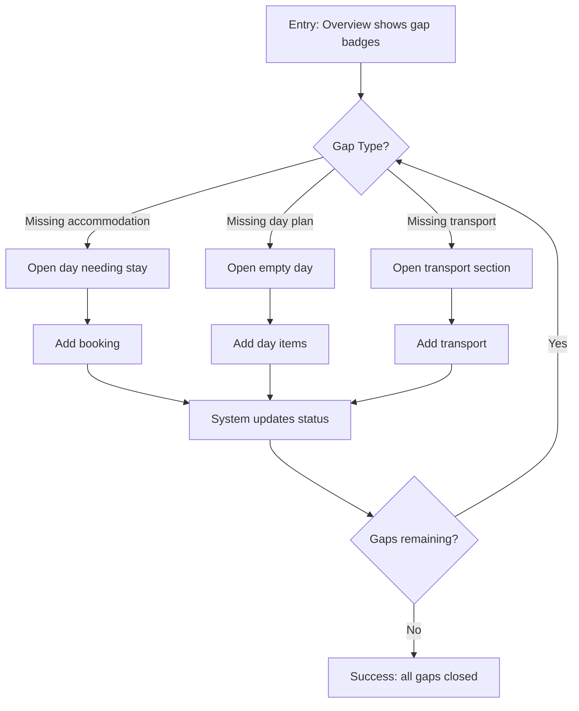
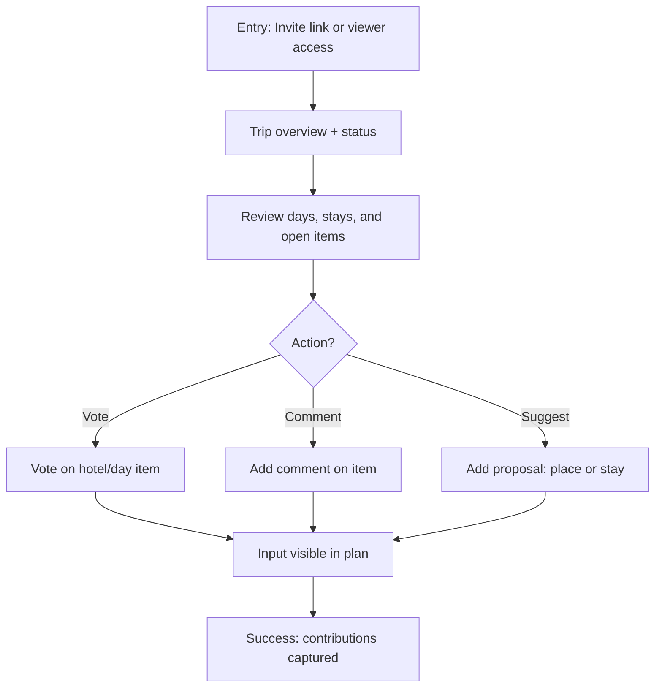

# UX Design Specification TravelPlan

**Author:** Tommy
**Date:** 2026-02-12

---

<!-- UX design content will be appended sequentially through collaborative workflow steps -->
## Executive Summary

### Project Vision
TravelPlan is a lightweight web app that helps self-organized travelers plan a full trip end-to-end without losing overview. It unifies hotels, transport, events, and the route itself into one coherent timeline so users always see what's set, what's open, and what's next.

### Target Users
Primary: Solo trip planners who want full control but are not technical experts.
Secondary: Light contributors who need clarity and the ability to suggest ideas without managing the plan.

### Key Design Challenges
- Preserve a full-trip overview without overwhelming non-technical users.
- Balance deep planning (route + logistics) with simple, fast interaction.
- Serve two usage contexts: long-range planning at home and quick reference on the move.

### Design Opportunities
- Status clarity: a simple, reliable "set vs. open" view across all days.
- Budget runway: show planned spending and upcoming payments in context.
- A single trip timeline that connects days, places, and bookings without complexity.

## Core User Experience

### Defining Experience
The core experience is a phased planning loop: transport frames the trip (start/end and route), accommodations fill in structure, and day plans finalize the details. The user should always feel they're progressing from rough skeleton to complete itinerary without losing overview.

### Platform Strategy
Web-only product. Planning is desktop-first (keyboard and large-screen clarity), while mobile/tablet is optimized for quick reference and light edits during the trip. No offline requirement.

### Effortless Interactions
- Adding/editing bookings and day items feels fast and low-friction.
- Switching between accommodations, day plans, and budget is seamless and consistent.
- Quick capture of day items while browsing other sources.
- Automatic updates: travel time calculations, cost totals, and budget comparisons.

### Critical Success Moments
- First moment: the user sees a simple, coherent trip overview with destinations, dates, and accommodations.
- Success moment: the trip is fully planned and everything feels consistent.
- Make-or-break: avoiding manual correction when changes happen (bookings, costs, routes).

### Experience Principles
- Frame first, details later.
- Show "set vs. open" at all times.
- No view whiplash across planning tools.
- Effortless capture with automatic updates.

## Desired Emotional Response

### Primary Emotional Goals
Users should feel excited and happy about the upcoming trip, with a sense of control and clarity. After planning, they should feel relaxed and ready.

### Emotional Journey Mapping
- Discovery: Curious and interested in how it works.
- Core planning: Natural flow without burden.
- Completion: Relaxed because everything is settled.
- When problems arise: Motivated to fix things, not blocked.
- Return visits: Fast overview, renewed excitement.

### Micro-Emotions
- Confidence over confusion
- Excitement over anxiety
- Delight over mere satisfaction

### Design Implications
- Show the impact of actions immediately (e.g., hotel selection reveals nearby attractions and travel time from the prior point).
- Use imagery or visual previews for attractions to spark anticipation.
- Map views of day plans or the full trip build confidence and inspire the "dreaming" feeling.
- Avoid repetitive tasks and manual sync between views.

### Emotional Design Principles
- Make progress feel visible and reassuring.
- Spark imagination with visual previews.
- Reduce anxiety through clear, immediate feedback.
- Never make users reconcile data across views.

## UX Pattern Analysis & Inspiration

### Inspiring Products Analysis
- Wanderlog: Strong because everything is in one place and gives a trip overview, but it becomes visually overloaded.
- TripIt: Straightforward and easy to use, but core value is gated by the paid tier.
- OneNote: Flexible and open-ended, but provides no guidance and requires constant restructuring.

### Transferable UX Patterns
Navigation Patterns
- Unified trip overview (Wanderlog) -> adapt to a cleaner, lighter dashboard that keeps clarity.
- Simple, linear task flow (TripIt) -> use for key setup steps like creating a trip and adding essentials.

Interaction Patterns
- Flexible capture (OneNote) -> enable quick, low-friction input for ideas and day items.
- Guided structure (TripIt/Wanderlog) -> provide light scaffolding so users do not have to invent structure.

Visual Patterns
- High-level summary first -> maintain a calm overview before diving into details.
- Clean, minimal hierarchy -> avoid visual overload while still showing completeness.

### Anti-Patterns to Avoid
- Visual overload that makes the overview feel chaotic (Wanderlog).
- Paywalling core value so the free version feels unusable (TripIt).
- Unstructured freedom that forces constant manual re-organization (OneNote).

### Design Inspiration Strategy
What to Adopt
- A unified "everything in one place" overview, but designed for clarity.
- Straightforward flows for key actions (trip setup, adding accommodations).

What to Adapt
- OneNote's flexibility, but with soft guidance and system-generated structure.
- Wanderlog's completeness, but with progressive disclosure and calm visual hierarchy.

What to Avoid
- Dense, visually heavy screens.
- Core functionality hidden behind paywalls.
- Manual restructuring as the normal workflow.

## Design System Foundation

### 1.1 Design System Choice
Established system: Material Design (Material UI)

### Rationale for Selection
- Speed first: mature component library, fast to implement.
- Predictable patterns: reduces UX risk for non-technical users.
- Family feel: easy to align through typography, color, spacing, and icon style even without a formal brand system.

### Implementation Approach
- Use Material UI as the baseline component system.
- Keep interaction patterns standard and familiar to reduce learning curve.
- Introduce a small set of custom components only when TravelPlan needs a unique pattern (e.g., trip timeline view).

### Customization Strategy
- Align typography and color palette to match the TravelBlogs visual "family."
- Use shared tokens for spacing, radii, and iconography.
- Keep layout density calm to avoid the visual overload seen in competing tools.

## 2. Core User Experience

### 2.1 Defining Experience
The defining experience is planning a trip by layering highlights, destinations, accommodations, and day items into a coherent, evolving plan. Users feel successful when the trip fills in visually and gaps disappear.

### 2.2 User Mental Model
Users already plan with a mix of tools (OneNote, TripIt, Wanderlog, paper).
They think in timelines for day plans and maps for destinations/routes.
They expect a planner with multiple coordinated views, each showing the right lens for the current task.
Confusion arises when changes create inconsistencies (double bookings, missing accommodations).

### 2.3 Success Criteria
- The plan visibly "fills up" as bookings and items are added.
- Gaps (missing accommodations, empty days) are clearly surfaced.
- Budgets and travel times calculate automatically.
- Adding details is fast and frictionless, even if planning itself takes time.

### 2.4 Novel UX Patterns
This relies on established patterns users already understand:
- Timeline view for day plans
- Map view for destinations and route
- Checklist/status indicators for gaps and completeness
The unique value comes from syncing these views into one coherent system.

### 2.5 Experience Mechanics
Initiation: Create a trip and add transport options to frame dates and route.
Interaction: Add accommodations, then fill day items within each day.
Feedback: The plan updates instantly - routes, budgets, and gaps reflect changes.
Completion: All days have plans, all nights have accommodations, and transport is clear.

## Visual Design Foundation

### Color System
Direction: Calm, travel-optimistic, trustworthy.
- Primary: Deep Teal #0F6B6D (clarity + confidence)
- Secondary: Warm Sand #E9D8A6 (holiday warmth)
- Accent: Sunrise Coral #F26B5B (energy + highlights)
- Background: Mist #F6F7F5 (light, calm canvas)
- Surface: White #FFFFFF
- Text Primary: Charcoal #1F2A2E
- Text Muted: Slate #5C6B73
- Success: #2E7D32
- Warning: #ED6C02
- Error: #D32F2F

Semantic use:
Primary for navigation and key actions, coral for highlights/set vs. open, sand for subtle emphasis.

### Typography System
Tone: Friendly and informal, but crisp for clarity.
- Primary Typeface: Source Sans 3 (clean, approachable, highly legible)
- Secondary/Accent: Fraunces for section headings (soft travel vibe)

Hierarchy (example):
- H1: 32/40, Fraunces, bold
- H2: 24/32, Fraunces, semibold
- Body: 16/24, Source Sans 3
- Small: 14/20, Source Sans 3

Content handling:
Short labels by default with expandable details (progressive disclosure).

### Spacing & Layout Foundation
- Density: Efficient, not airy.
- Spacing scale: 4px base (4/8/12/16/24/32/48).
- Grid: 12-column layout for desktop; stacked single column on mobile.
- Layout principles:
  - Overview first, details on demand.
  - Consistent alignment to reduce view switching fatigue.
  - Clear separation between trip-level, day-level, and item-level areas.

### Accessibility Considerations
- Maintain strong text contrast (AA where possible).
- Clear focus states for keyboard users.
- Avoid relying solely on color to indicate set vs. open.

## Design Direction Decision

### Design Directions Explored
Six design directions were explored to test layout density, hierarchy, and navigation patterns (Calm Overview, Route First, Checklist Flow, Focus Mode, Split Planning, Navigation Rail).

### Chosen Direction
Direction G: Navigation Rail

### Design Rationale
- Supports fast mode switching (overview, route, stay, day, budget) without losing context.
- Reinforces the user's mental model of multiple coordinated views.
- Keeps set vs. open status visible while enabling quick transitions.

### Implementation Approach
- Use a horizontal mode rail on desktop and a compact tab bar on mobile.
- Maintain persistent overview summary across all modes.
- Ensure any change in one mode updates the others immediately.

## User Journey Flows

### Tom - Primary Success Path
Description: Tom starts a new trip, frames it with transport and dates, adds accommodations, then fills day items. Success is a visibly filling plan with clear gaps closing.

### Tom - Gaps & Recovery
Description: Tom detects missing accommodations, empty days, missing transport, or long gaps. He fills the missing parts and sees the system confirm closure.

### Konni - Viewer + Light Contributor
Description: Konni accesses via invite or viewer role, sees the overview, votes on options, and adds suggestions.

### Journey Patterns
- Overview as anchor: Every journey starts with the status overview.
- Gap badges: Missing items surface as actionable signals.
- Multi-view sync: Changes in one view update all related views.

### Flow Optimization Principles
- Minimize steps from gap detected to gap closed.
- Provide immediate feedback when an item is added or updated.
- Keep decisions contextual (route, stay, and day details visible).

## Component Strategy

### Design System Components
Use Material UI for foundation components: AppBar, Tabs, Buttons, Inputs, Selects, Date Pickers, Dialogs, Drawers, Cards, Chips, Badges, Tables, Lists, Tooltips, Snackbar/Alerts.

### Custom Components

#### Trip Overview Dashboard
Purpose: Summarize trip health (gaps, budget, route snapshot).
Usage: Default landing after selecting a trip.
Anatomy: Summary cards, gap panel, mini map, budget strip.
States: Loading, normal, empty, warnings.
Accessibility: Clear headings, ARIA for status counts.

#### Navigation Rail / Mode Switcher
Purpose: Switch between Overview, Route, Stay, Day, Budget.
Usage: Persistent navigation across all trip views.
States: Active, hover, disabled.
Accessibility: Keyboard navigable, ARIA tabs.

#### Day Plan Timeline
Purpose: Show daily schedule and allow quick additions.
Usage: Day view and within overview preview.
States: Empty, partial, full, error.
Accessibility: Keyboard reorder optional, clear labels.

#### Accommodation Table / Stay Grid
Purpose: Show nightly stays across the trip.
Usage: Stay view and gap detection.
States: Missing, planned, booked.
Accessibility: Table semantics with row/column labels.

#### Gap Badges + Alerts
Purpose: Surface missing items and inconsistencies.
Usage: Overview and per-day sections.
States: Warning, resolved, dismissed.
Accessibility: Text labels, not color only.

#### Route Map + Travel Time
Purpose: Visualize route and time between stops.
Usage: Route view and mini map in overview.
States: Loading, route ready, error.
Accessibility: Text summary of route for non-map users.

#### Budget Runway Summary
Purpose: Show planned spend vs budget and upcoming payments.
Usage: Budget view and overview strip.
States: On track, over budget, missing costs.
Accessibility: Numeric summary + clear labels.

#### Suggestion / Voting Widget
Purpose: Allow Konni to vote or suggest options.
Usage: Item detail cards.
States: Voted, pending, closed.
Accessibility: Clear action labels, feedback after voting.

### Component Implementation Strategy
- Build custom components on top of Material UI tokens.
- Keep visual density efficient (4px spacing scale).
- Use consistent status chips for set vs. open.
- Ensure immediate cross-view updates.

### Implementation Roadmap
Phase 1 (MVP): All listed custom components.
Phase 2+: Enhanced map interactions, richer suggestion workflows, advanced budgeting insights.

## UX Consistency Patterns

### Button Hierarchy
When to Use: Primary for the next step in planning, secondary for supporting actions, tertiary for low-stakes actions.
Visual Design: Primary = solid teal, secondary = outline teal, tertiary = text button.
Behavior: Primary always visible in each view (e.g., Add Day Item, Add Stay). Destructive actions require confirmation.
Accessibility: Focus ring visible; buttons use clear labels (no icon-only primary actions).
Mobile Considerations: Primary action anchored at bottom or top-right, never hidden.
Variants: Primary, Secondary, Ghost, Destructive.

### Feedback Patterns
When to Use: Use success for saved changes, warning for gaps, error for failed sync.
Visual Design: Snackbars for transient updates, inline banners for persistent gaps.
Behavior: Immediate feedback on add/edit; longer tasks show progress states.
Accessibility: Announcements via ARIA live regions.
Mobile Considerations: Snackbars docked to bottom; avoid covering CTAs.

### Form Patterns
When to Use: Trip setup, transport, accommodation, day items, budget entries.
Visual Design: Inline labels, short inputs with progressive disclosure for details.
Behavior: Inline validation on blur; draft saving for long forms.
Accessibility: Clear error messages, labels tied to inputs.
Mobile Considerations: Single-column forms, large tap targets.

### Navigation Patterns
When to Use: Persistent navigation rail for mode switching.
Visual Design: Mode rail with active indicator and status badges.
Behavior: Switching modes preserves scroll and context; no data loss.
Accessibility: Keyboard navigation with ARIA tab list.
Mobile Considerations: Compact tab bar with 4-5 key modes.

### Modal and Overlay Patterns
When to Use: Confirm destructive actions, add/edit detail in context.
Visual Design: Dialog with clear primary/secondary actions.
Behavior: Escape key closes; auto-focus first input.
Accessibility: Focus trapping and ARIA role=dialog.
Mobile Considerations: Full-screen sheet for complex forms.

### Empty and Loading States
When to Use: New trip, empty day, missing accommodations, loading map.
Visual Design: Calm illustration or icon, single clear action.
Behavior: Actionable guidance (Add stay, Add day item).
Accessibility: Textual guidance not dependent on imagery.
Mobile Considerations: Short, scannable copy.

### Search and Filtering Patterns
When to Use: Filtering day items, stays, or suggestions.
Visual Design: Search field with chips for filters.
Behavior: Instant results, clear reset.
Accessibility: Labels and focus order preserved.
Mobile Considerations: Expandable search bar.

## Responsive Design & Accessibility

### Responsive Strategy
Desktop: Multi-column layouts, dense tables, and rich overview panels.
Tablet: Near-desktop layout with responsive stacking as needed.
Mobile: Hamburger menu, simplified layouts, focus on the day plan first.

### Breakpoint Strategy
Use standard breakpoints:
- Mobile: 320-767
- Tablet: 768-1023
- Desktop: 1024+
Desktop-first layout with responsive stacking for smaller screens.

### Accessibility Strategy
No formal accessibility standard required at this stage.
- Ensure strong text contrast.
- Full keyboard navigation across all views.
- Focus indicators always visible.
- Touch targets >= 44x44px.
- Map views paired with text summaries.

### Testing Strategy
- Test on real devices (desktop, tablet, mobile).
- Browser coverage: Chrome, Safari, Edge.
- Keyboard-only flows for all core actions.
- Screen reader checks (VoiceOver/NVDA).
- Color-blindness simulation for status indicators.

### Implementation Guidelines
- Use relative units (rem, %) for responsive layouts.
- Mobile-first media queries where appropriate.
- Semantic HTML and ARIA roles on custom components.
- Ensure layout reflows do not break set vs. open clarity.
